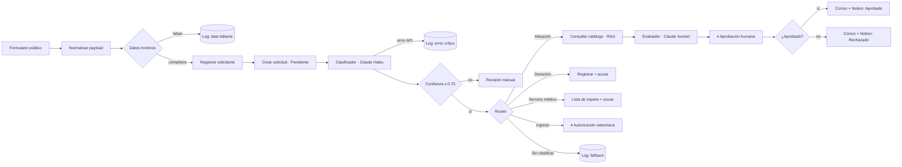

# Mesa de Entrada Única — Refugio «Cuatro Patitas y Media»

Ecosistema de automatización con IA que consolida las cuatro vías de contacto de un refugio de animales —adopción, donación, servicio médico e ingreso de animales— en un único formulario público, interpreta el texto libre con un modelo de lenguaje y enruta cada petición a su proceso, deteniéndose ante una persona antes de cualquier acción con consecuencia real.

**Proyecto Final — Curso de Automatización con IA**
Alejandra Cab Pérez · Septiembre 2026

---

## Enlaces

| Recurso | Enlace |
|---|---|
| Formulario público | https://fmvhbt5683.app.n8n.cloud/form/refugio-solicitudes |
| Base de datos en Notion (modo lectura) | https://harvest-target-6cd.notion.site/CODERHOUSE-Refugio-Cuatro-Patitas-y-Media-3e54817126d2811b9fcfce3e5fac37f1 |
| Dashboard de control | https://harvest-target-6cd.notion.site/Dashboard-de-Control-3e54817126d2812f866dd1bd839827f5 |
| Video demo (3 min) | [Google Drive](https://drive.google.com/file/d/1oIxGAdLwIhHm81jByMneNVFKotztFYaP/view?usp=drive_link) |
| Documentación técnica | [`docs/Entrega-Final-Refugio-Cuatro-Patitas.pdf`](docs/Entrega-Final-Refugio-Cuatro-Patitas.pdf) |

---

## El problema

Un refugio que recibe perros, gatos y cuyos atiende peticiones que llegan por canales dispersos y en lenguaje coloquial. «Quiero adoptar a Rocco», «les mando dos bultos de croqueta», «hay un perro atropellado en Periférico» y «¿cuándo hay campaña de esterilización?» son cuatro procesos distintos que hoy alguien clasifica a mano, leyendo uno por uno.

El costo no es solo el tiempo. Es que un reporte urgente puede quedar sepultado bajo veinte correos de donación.

## La solución

Un solo punto de entrada. La IA lee, clasifica y enruta. Las decisiones con consecuencia irreversible se detienen ante una persona.



### Stack

| Categoría | Tecnología | Rol |
|---|---|---|
| Orquestador | n8n Cloud · 37 nodos | Flujo principal |
| Base de datos | Notion · 4 bases relacionadas | Memoria, catálogo y bitácora |
| Procesamiento IA | Anthropic Claude · 2 modelos | Clasificación estructurada y evaluación con recuperación |
| Canal de salida | Gmail API | Acuses al solicitante y correos de aprobación con botones |

---

## El «cerebro»: cuatro bases relacionadas

| Base | Rol | Relaciones |
|---|---|---|
| **Solicitudes** | Registro maestro. Ciclo de vida completo de cada petición | → Solicitantes, → Animales, ← Log |
| **Solicitantes** | Ficha de la persona. Aporta historial y perfil al dictamen — ver [Limitaciones conocidas](#limitaciones-conocidas) | ← Solicitudes |
| **Animales** | Catálogo del refugio. Fuente de la recuperación RAG | ← Solicitudes |
| **Log de Ejecuciones** | Bitácora de corridas y errores. Alimenta la tasa de errores | → Solicitudes |

El campo `Requisitos de Adopción` en la base **Animales** es texto libre a propósito. Es lo que convierte esto en recuperación aumentada y no en un filtro de base de datos: contiene restricciones que ningún `WHERE` podría expresar.

> *«Los cuyos son animales sociales: solo se entrega en pareja o a hogar que ya tenga otro cuyo. Jaula mínima de 120 cm. Prohibido convivir con perros o gatos sin separación física permanente.»*

El modelo lee ese párrafo, lo cruza contra el perfil del solicitante y decide. Un filtro no puede.

---

## Optimización de costos

No se usa un solo modelo. Se usa el más barato capaz de resolver cada tarea, y el caro se reserva para la única decisión que exige razonar sobre restricciones cruzadas.

| Tarea | Modelo | Justificación | Costo/ejecución |
|---|---|---|---|
| Clasificar intención y extraer entidades | Claude Haiku 4.5 | Tarea cerrada, cinco etiquetas, salida JSON breve. No requiere razonamiento multi-paso | ~USD 0.0002 |
| Evaluar compatibilidad adoptante–animal | Claude Sonnet | Lee el catálogo recuperado y cruza requisitos escritos en lenguaje natural contra el perfil del hogar | ~USD 0.0095 |
| Evaluar urgencia de ingreso | Claude Haiku 4.5 | Clasificación ternaria sobre texto corto. El humano confirma después | ~USD 0.0003 |

**Ahorro estimado:** con 200 solicitudes mensuales (25% adopciones), la arquitectura cuesta **USD 0.52/mes** frente a **USD 2.38** si todo pasara por el modelo caro. Un **78% menos**.

Pero el hallazgo más útil del proyecto fue otro: **el modelo elegido importa menos que cuántas veces lo llamas.** Una bandera mal puesta hizo que el evaluador corriera 12 veces en una sola solicitud —USD 0.11 en lugar de 0.0095— un factor de 12x que ninguna elección de modelo habría compensado.

El segundo ahorro real está antes de la IA, no en ella: el nodo de validación corta las solicitudes incompletas **antes** de cualquier llamada a la API. Cero tokens consumidos.

---

## Seguridad y resiliencia

### Minimización de datos

| Dato | ¿Llega a la API de IA? | Tratamiento |
|---|---|---|
| Mensaje en texto libre | Sí | Es el insumo del clasificador |
| Ciudad | Sí | Necesaria para urgencia y cobertura |
| Perfil de vivienda y mascotas | Solo en la ruta de adopción | El evaluador lo requiere para el dictamen |
| Correo electrónico | **No** | Se recupera hasta el nodo de Gmail |
| Teléfono | **No** | Nunca entra a un prompt |
| Nombre completo | **No** | El prompt trabaja con el perfil, no con la identidad |

El principio: **el dato que no viaja no se puede filtrar.**

### Rutas de error

| Falla | Detección | Garantía |
|---|---|---|
| Datos mínimos ausentes | Validación previa a la IA | Cero tokens consumidos |
| API de IA caída | 3 reintentos con espera de 2 s y salida de error dedicada | La solicitud conserva el mensaje original y queda reprocesable |
| Salida del modelo malformada | El parser estructurado rechaza el JSON | Ningún dato corrupto entra a la base |
| Clasificación poco confiable | Umbral de 0.70 comparado como número | No se ejecuta ninguna acción automática |
| Tipo no reconocido | Salida de respaldo del router | Una solicitud jamás cae en el vacío |
| Nadie responde la aprobación | Límite de espera: 3 días en adopción, 12 horas en ingreso | La ejecución no queda suspendida indefinidamente |

### Human-in-the-loop

Dos puntos donde el flujo se detiene y espera a una persona:

| Punto | Acción bloqueada | Por qué |
|---|---|---|
| **Dictamen de adopción** | Contactar al adoptante | Entregar un animal a un hogar incompatible es irreversible y afecta a un ser vivo |
| **Autorización de ingreso** | Comprometer cupo en cuarentena | El cupo es finito y el sistema no puede verificarlo con fiabilidad |

El correo de aprobación incluye el dictamen completo, el score y los animales descartados con su motivo, para que la persona decida con el mismo contexto que tuvo el modelo. El cuerpo del mensaje lo dice explícitamente: *«El sistema NO ha contactado al solicitante»*.

### Prevención de bucles y errores de tipo

- **Bucles infinitos:** el disparador es un formulario externo, no un sondeo sobre la base de Solicitudes. El flujo escribe en Notion pero ningún disparador observa esa base. Estructuralmente no existe el ciclo.
- **Comparación de tipos:** la compuerta de confianza evalúa `Number($json.output.confianza) >= 0.7` con validación estricta. Si el modelo devolviera `"0.85"` como cadena, el casteo explícito lo resuelve en lugar de que el filtro falle en silencio.
- **Prompts dinámicos:** ningún dato del caso está escrito a mano. El catálogo se serializa desde Notion en cada ejecución.
- **Credenciales:** ninguna clave aparece en el JSON exportado. n8n las almacena por separado.

---

## Test de Estrés

Cinco ejecuciones en producción, incluyendo los caminos infelices.

| # | Escenario | Ejec. | Ruta tomada | Estado final | Resultado |
|---|---|---|---|---|---|
| 1 | Adopción viable | 16 | Clasificación → RAG → HITL → aprobación | Aprobado por Humano, score 85 | ✅ |
| 2 | Formulario incompleto | 17 | Corte en validación | Sin registro de solicitud, solo entrada en Log | ✅ |
| 3 | Mensaje ambiguo | 18 | Confianza 0.35 → revisión manual | Esperando Aprobación, sin contactar al solicitante | ✅ |
| 4 | Adopción inviable | 21 | RAG → NO APTO → HITL → rechazo | Rechazado, score 5 | ✅ |
| 5 | Rescate urgente | 22 | Urgencia Alta → autorización veterinaria | Aprobado por Humano | ✅ |

### Lectura de la tasa de errores

El Log acumula 25 eventos: 14 éxitos y 11 de otros tipos. Esa cifra necesita interpretación, porque **7 de esos 11 son el sistema protegiéndose, no fallando**:

| Resultado | n | ¿Falla del sistema? |
|---|---|---|
| Éxito | 14 | — |
| Error API IA | 4 | Parcialmente |
| Rechazado por Humano | 2 | No. Es el HITL funcionando |
| Dato Faltante | 2 | No. Es la validación cortando a propósito |
| Baja Confianza | 2 | No. Es el umbral frenando |
| Timeout | 1 | Reintento exitoso |

---

## Errores encontrados durante la construcción

Cinco fallas reales, de cinco familias distintas. Ninguna se detecta leyendo el diagrama: todas aparecieron al ejecutar.

| Familia | Qué pasó | Corrección |
|---|---|---|
| **Tipo de dato** | Un teléfono opcional vacío se enviaba como `""`. Notion acepta `null` pero rechaza la cadena vacía | Expresión condicional que envía `null` explícito |
| **Cardinalidad** | El evaluador corrió 12 veces porque el nodo anterior emitía 11 fichas | `executeOnce` en el nodo que debe correr una sola vez |
| **Linaje de datos** | La consulta al catálogo rompe la cadena de *paired items* y `.item` deja de resolver | `.first()` en la rama posterior |
| **Límite de generación** | El dictamen de rechazo se truncaba al topar `maxTokensToSample` y el parser lo rechazaba | Techo realista más límites de longitud por campo en el prompt |
| **Especificación del prompt** | El evaluador devolvía APTO en un rechazo porque encontraba un animal sustituto | Separar «¿puede adoptar *este* animal?» de «¿puede adoptar *alguno*?» |

El último es el más instructivo: **la IA hizo exactamente lo que se le pidió; el error estaba en lo que se le pidió.** En estos sistemas el riesgo no vive en el modelo, vive en la especificación.

---

## Limitaciones conocidas

### El solicitante se duplica

El nodo `Registrar Solicitante` crea una ficha nueva en cada ejecución. No comprueba si esa persona ya existe, de modo que un donante recurrente que envía tres solicitudes queda como tres personas distintas y su historial se fragmenta.

Es la limitación más relevante del sistema, porque contradice el propósito de la base: separar Solicitantes de Solicitudes solo tiene sentido si la persona es única. Hoy la separación existe en el esquema pero no se sostiene en la práctica.

**Cómo se resolvería.** Insertar dos nodos antes de la creación:

1. Consultar la base Solicitantes filtrando por correo electrónico.
2. Una compuerta: si hay resultado, reutilizar ese `id` para la relación; si no, crear la ficha.

El correo funciona como clave natural porque el formulario ya lo exige. La consulta añade unos 200 ms y ninguna llamada al modelo, así que el costo es despreciable.

No se implementó por una decisión de riesgo: el cambio toca la rama que alimenta todas las demás, y se detectó una vez que el Test de Estrés ya había pasado. Modificarla sin volver a ejecutar las cinco pruebas habría dejado el sistema en un estado no verificado.

### Otras limitaciones

| Limitación | Impacto | Mitigación prevista |
|---|---|---|
| El catálogo se serializa completo en el prompt del evaluador | Con doce animales es trivial; con doscientos el costo por consulta crecería de forma lineal | Filtrar por especie antes de recuperar, o migrar a búsqueda vectorial |
| `.first()` en la rama de adopción | Correcto porque cada ejecución atiende una sola solicitud; se rompería si el flujo procesara lotes | Restaurar el linaje de *paired items* con un nodo Merge |
| Sin reintento manual de solicitudes en estado `Error` | Una solicitud fallida requiere reproceso a mano | Flujo programado que relance las que queden en `Error` |
| El umbral de confianza es un valor fijo | 0.70 se eligió por criterio, no por medición | Calibrar contra un conjunto de mensajes etiquetados |

---

## Estructura del repositorio

```
.
├── README.md
├── docs/
│   └── Entrega-Final-Refugio-Cuatro-Patitas.pdf   # Diagrama, esquemas JSON, matriz de costos, seguridad
├── flujo/
│   └── mesa-de-entrada-ia.json                    # Flujo exportado desde n8n
└── evidencias/
    ├── Test de Estrés_prueba-1-adopcion-aprobada.png              # Capturas de las cinco ejecuciones
    ├── Test de Estrés_prueba-2-corte-datos-faltantes.png
    ├── Test de Estrés_prueba-3-baja-confianza.png
    ├── Test de Estrés_prueba-4-adopcion-rechazada.png
    └── Test de Estrés_prueba-5-ingreso-urgencia-alta.png
```

El video demo (3 min) no se aloja en el repositorio — GitHub no lo reproducía correctamente — sino en Google Drive: ver enlace en la tabla de [Enlaces](#enlaces).
